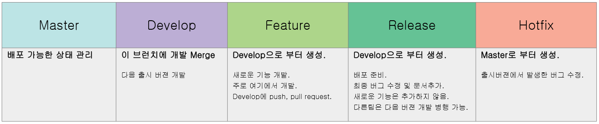
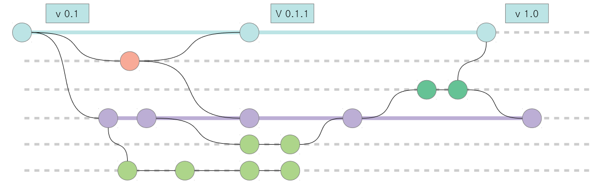
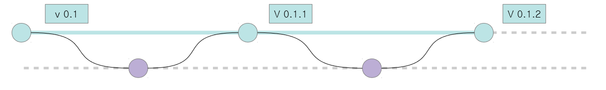

# git branch workflowㅑ

### 모든 branch를 운용할 경우

* 최초 github에 repo 생성. ( 기본 master branch ), develop branch 생성.

1. 업무에 따라 pull 한다.
<pre>
 Feature : git pull origin develop
 Release : git pull origin develop
 Hotfix : git pull origin master
</pre>
1-2. 처음 개발일 경우 clone으로 로컬 repo를 생성한다.
<pre>
 git clone https://urlhttps://url
</pre>

2. 업무에 따라 feature/기능, hotfix-버전, release-버전 branch 생성
<pre>
 Feature : git checkout -b feature/기능 develop
 Release : git checkout -b release-버전 develop
 Hotfix : git checkout -b hotfix-버전 master
</pre>

* branch 확인 : git branch, git branch -a

3. 개발 파일 commit
<pre>
 git add . 또는 git add 파일
 확인 : git status
 git commit -m “개발 내용”
</pre>

4. 개발후 pull request를 위해 push
<pre>
 Feature : git push origin feature/기능
 Release : git push origin release-버전
 Hotfix : git push origin hotfix-버전
</pre>

5. PR이 완료되면 merge 한다. ( GUI 이용 )

6. merge가 완료되면 branch를 삭제한다.
<pre>
 Feature : git branch -d feature/기능
 Release : git branch -d release-버전
 Hotfix : git branch -d hotfix-버전
</pre>

### develop branch만 운용할 경우

* 최초 github에 repo 생성. ( 기본 master branch ), develop branch 생성.

1. master를  pull 한다.
<pre>
 git pull origin master
</pre>
1-2. 처음 개발일 경우 clone으로 로컬 repo를 생성한다.
<pre>
 git clone https://urlhttps://url
</pre>

2. develop branch를 생성한다.
<pre>
 git checkout -b develop master
</pre>
2-2. develop branch가 기존에 있을 경우
<pre>
 git checkout develop
</pre>

* branch 확인 : git branch, git branch -a

3. 개발 파일 commit
<pre>
 git add . 또는 git add 파일
 확인 : git status
 git commit -m “개발 내용”
</pre>

4. 개발후 pull request를 위해 push
<pre>
 git push origin develop
</pre>

5. PR이 완료되면 merge 한다. ( GUI 이용 )

# reference
> * Vincent의 branching model
>   * “feature ? develop ? release ? hotfixes ? master” 단계로 branch를 나눠서 코드를 관리하는 전략
> * https://github.com/gmlwjd9405/git-collaboration
